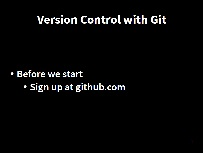

## Topics

0.  [Introduction](index.html)
1.  [Setting Up Git](01-setup.html)
2.  [Creating a Repository](02-create.html)
3.  [Tracking Changes](03-changes.html)
4.  [Exploring History](04-history.html)
5.  [Collaborating](05-collab.html)
6.  [Conflicts](06-conflict.html)
7.  [Ignoring Things](07-ignore.html)

[Slides to accompany this material](version-control-with-git-slides.pdf)

> ## Learning Objectives {.objectives}
>
> *   Understand when version control is useful and how it works

**START**

## What is Version Control? ##

Also called **revision control** or **source control**.  At their simplest these are tools which track **changes** to files.  

## Why should I use it? - Three reasons##

### 1. A More Efficient Backup ###

We've **all** been in this situation before -  **multiple nearly-identical** versions of the same file with no meaningful **explanation** of the differences are. 

If we're just dealing with Docs, some word processors let us deal with this a little better, like Microsoft Word ("Track Changes") or Google Docs version history. BUT **research isn't just Words docs**, it's code and data and diagrams too. 

Using **version control** means **we don't keep dozens of different versions** of our files hanging about taking up **space**, and when we store a **revision**, we store an **explanation** of what changed.  Explain how later.

### 2. Reproducibility ###

When you use  **version control**, at any point in the future, you can retrieve the **correct versions** of your documents, scripts or code.  So, for example, a year after **publication**, you can get hold of the **precise combination** of scripts and data that you used to assemble a paper.  

Version control makes **reproducibility** simpler. Without using version control it's very hard to say that your research is truly reproducible...

### 3. To Aid Collaboration ###

As well as maintaining a revison history, VC tools also help multiple authors **collaborate** on the **same file** or set of files.

 **Professional software developers** use VC work in large **teams** and to keep track of what they've done.  They know who has changed what and when.  And who to **blame** when things break!

**Every** large software development project relies on VC, and most programmers use it for their small jobs as well.

**VC not just for software**: papers, small data sets -  anything that changes over time, or needs to be shared **can**, and **probably should** be stored in a version control system.

We'll look at both the backup and collaboration scenarios, but first it's useful to understand what going on **under the hood**.

## How do Version Control Tools Work? ##

---------------------------------------------------------------

**Version control systems start by storing the base version** of the file that you save and then **store just the changes** you made at each step on the way. You can think of it as a tape: if you rewind the tape and **start** at the base document, then you can **play back** each change and end up with your latest version.

---------------------------------------------------------------

Once you think of **changes as separate from the document** itself, you can then think about "playing back" different sets of changes onto the base document and getting different versions of the document. For example, **two users can make independent sets of changes** based on the same document.

---------------------------------------------------------------

If there aren't conflicts, you can even try to play two sets of changes onto the same base document.  A process call **merging**.

---------------------------------------------------------------

## Version Control Alternatives ##

**These are the most popular current Version Control systems**:  

**Subversion** has been around since about 2000, it was developed to replace the venerable **Concurrent Versioning System (CVS)**.  It introduced such revolutionary concepts as the ability **rename** files whilst retaining their version history.

With **Subversion** a **single master copy** of the repository (the files under version control) exists - the only place where all revision history is kept.  If you're working as **team** you need to connect to the **central server** to store a revision

---------------------------------------------------------------

**Mercurial** and **Git** are newer and work a little differently - they are **Distributed** Version control systems - each developer in a team has their **own full copy** of the repository which are then synchronised.  You can use Git without a network connection and there's no single point of failuire.

Both **Mercurial** and **Git** arose from the need to find a new Version Control System for the Linux Kernel, after BitKeeper became non-free in 2005.

**Git** was written by Linus Torvalds **(who he?)** (maintainer of the Linux kernel), to scratch his own itch, so if you think it's idiosyncractic in places, you know who to blame.

----------------------------------------------------------------

Git **now most widely used** and has found wider prominence partly through the rise of **GitHub** - a web based Git **repository hosting** service which simplifies **collaboration**.  

GitHub also provide project management bells and whistles like **bug tracking**, **task management**.

You don't **need** to use GitHub to employ Git, but we will use it today to demonstrate the use of remote repositories.

## Other Resources

* [Overview](version-control-with-git-slides.odp)
* [Glossary Reference](reference.html)

[Next -  Setting Up Git ](01-setup.html)
